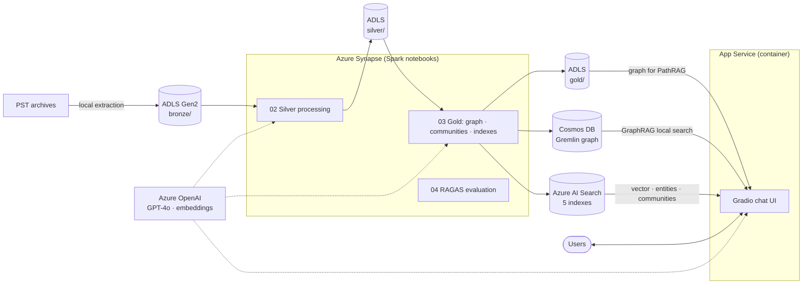

<div align="center">

# TacitGraph · Azure

### From PST to a knowledge graph you can chat with — at enterprise scale on Azure

**An end-to-end RAG pipeline** on Azure: ingestion, knowledge-graph construction and graph-aware retrieval as managed cloud services.

*The cloud deployment of [TacitGraph](https://github.com/MRafiqAsim/tacitgraph): Synapse for processing, Cosmos DB for the knowledge graph, AI Search for retrieval and App Service for the chat UI.*

[](https://github.com/MRafiqAsim/tacitgraph-azure/actions/workflows/ci.yml)
[](pyproject.toml)
[](LICENSE)
[](https://github.com/astral-sh/uv)
[](https://github.com/astral-sh/ruff)
[](https://paypal.me/mrafiq89/5EUR)

</div>

---

TacitGraph turns Outlook archives into a knowledge graph you can question in plain language, with five retrieval strategies (vector, GraphRAG, PathRAG, hybrid, ReAct) and citations back to the source emails. This repository runs the same pipeline on Azure managed services, so it scales to archives with hundreds of thousands of graph nodes and serves the chat UI to a whole organisation.

> New to TacitGraph? Start with the **[main repository](https://github.com/MRafiqAsim/tacitgraph)**, which explains the pipeline and runs entirely on a laptop.

## Architecture



| Component | Service | Role |
|---|---|---|
| Data lake | ADLS Gen2 | Bronze / Silver / Gold layers as JSON |
| Processing | Synapse Analytics (Spark pool) | Silver and Gold notebooks |
| LLM + embeddings | Azure OpenAI (GPT-4o, text-embedding-3-small) | Extraction, summaries, answers |
| Graph store | Cosmos DB (Gremlin API) | One-hop neighbourhoods for GraphRAG local search |
| Search | Azure AI Search (HNSW + semantic ranker) | Chunks, entities, communities, thread and attachment summaries |
| Path finding | In-memory NetworkX graph loaded from ADLS | Multi-hop PathRAG traversal (Gremlin is too slow for exhaustive DFS) |
| UI | App Service for Containers | Gradio chat app |
| Monitoring | Application Insights (optional) | Logs and traces |

<details>
<summary>Detailed data flow</summary>


</details>

## Deploy

### Prerequisites

- Azure OpenAI with GPT-4o and text-embedding-3-small deployments
- Azure AI Search, Cosmos DB (Gremlin API), ADLS Gen2, a Synapse workspace with a Spark pool, Container Registry and App Service (Linux, B2 or larger — the graph is held in memory)
- Azure CLI, Docker and [uv](https://docs.astral.sh/uv/)

### 1. Extract the Bronze layer locally

PST parsing depends on native libraries (libpff) that cannot be installed on Synapse's managed Spark pools, so this step runs on your machine:

```bash
uv sync --extra ingest
uv run tacitgraph-ingest --pst ./archive.pst --output ./data
```

### 2. Upload data, code and config to ADLS

```bash
for dir in "data/bronze:bronze" "src:code/src" "config:code/config"; do
  az storage blob upload-batch --account-name <adls-account> --destination <container> \
    --source "${dir%%:*}" --destination-path "${dir##*:}" --overwrite
done
```

### 3. Run the Synapse notebooks

Import the notebooks from [`synapse/notebooks`](synapse/notebooks), fill in the environment cell of each, and run them in order:

| # | Notebook | Output |
|---|---|---|
| 1 | `01_bronze_ingestion` | Bronze layer from files already on ADLS (optional) |
| 2 | `02_silver_processing` | Classified, cleaned and chunked threads with entities, relationships and summaries |
| 3 | `03_a_gold_build_graph` | Knowledge graph and entity catalog on ADLS |
| 4 | `03_b_gold_insert_to_cosmos_db` | Graph loaded into Cosmos DB Gremlin |
| 5 | `03_c_gold_detect_communities` | Leiden communities with LLM summaries |
| 6 | `03_d` … `03_h` | AI Search indexes: `kg-chunks`, `kg-entities`, `kg-communities`, `kg-thread-summaries`, `kg-attachment-summaries` |
| 7 | `04_ragas_evaluation` | RAGAS scores for all five strategies |
| 8 | `05_pipeline_stats` | Layer statistics and entity / relationship reports |

### 4. Deploy the chat app

```bash
az acr login --name <registry>
docker build -t <registry>.azurecr.io/tacitgraph:latest .
docker push <registry>.azurecr.io/tacitgraph:latest

az webapp config container set --name <app> --resource-group <rg> \
  --container-image-name <registry>.azurecr.io/tacitgraph:latest \
  --container-registry-url https://<registry>.azurecr.io
```

Configure the app with the variables from [`.env.template`](.env.template), plus:

```bash
az webapp config appsettings set --name <app> --resource-group <rg> --settings \
  WEBSITES_PORT=8000 WEBSITES_CONTAINER_START_TIME_LIMIT=600 USE_ADLS_GRAPH=true
```

The container start limit is raised because the app loads the Gold graph into memory at startup.

## Run locally against Azure

```bash
uv sync --extra azure
cp .env.template .env      # fill in the Azure endpoints and keys
uv run tacitgraph-app --mode llm
```

## Configuration

| What | Where |
|---|---|
| Azure endpoints, keys, retrieval options | `.env` / App Service settings (see [`.env.template`](.env.template)) |
| Description of your corpus, injected into every LLM prompt | `PROMPT_DOMAIN_CONTEXT`, or `domain_context` in [`config/prompts.json`](config/prompts.json) |
| All LLM prompts | [`config/prompts.json`](config/prompts.json) |
| Entity types, relationship normalisation, name aliases | [`config/entity_config.json`](config/entity_config.json) |
| Work / personal classification rules | [`config/sensitivity_rules.yaml`](config/sensitivity_rules.yaml) |

## Development

```bash
uv sync --all-extras
uv run pre-commit install
uv run pytest
uv run ruff check . && uv run ruff format --check .
```

CI runs linting, the test suite on Python 3.11 and 3.12, and a Docker build for every push and pull request.

## Privacy and security

Mailbox archives contain personal data. The pipeline classifies and skips personal email, keeps all data inside your own Azure subscription, and never commits data or secrets (`data/` and `.env` are git-ignored). Prefer managed identities over account keys where your services support them, and make sure you are authorised to process the archives you load.

## Support

If TacitGraph saves you time, you can [buy me a coffee (€5)](https://paypal.me/mrafiq89/5EUR) ☕ — and a ⭐ on the [main repository](https://github.com/MRafiqAsim/tacitgraph) helps others find it.

## License

[Apache License 2.0](LICENSE). The `src/tacitgraph/pathrag/` directory contains code adapted from [PathRAG](https://github.com/BUPT-GAMMA/PathRAG) and [LightRAG](https://github.com/HKUDS/LightRAG) under the MIT License; see [`NOTICE`](NOTICE).
